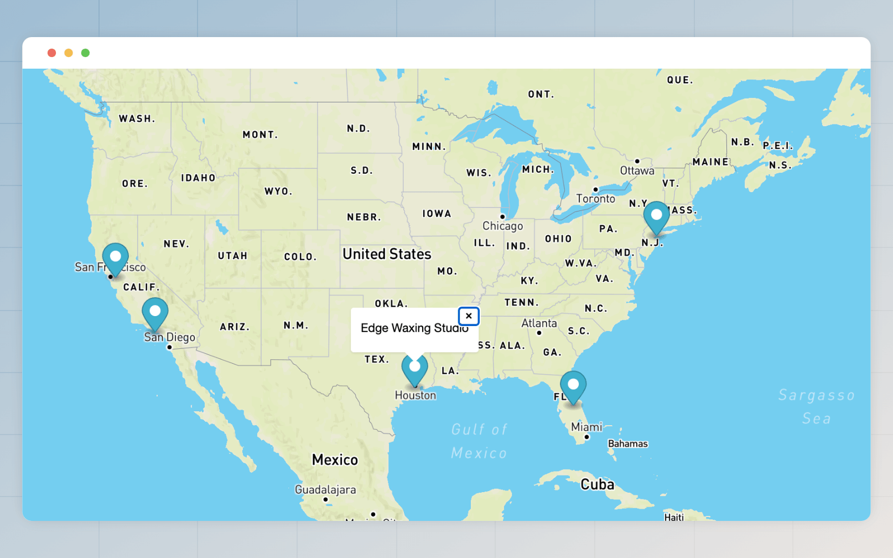

# Provide/inject API
The provide/inject API is inspired by the [Svelte's context API](https://svelte.dev/tutorial/context-api) and the [Vue's provide/inject API](https://vuejs.org/guide/components/provide-inject.html#provide-inject). The purpose is to share the state with a component tree without explicitly passing it as props.

Most of the time, a group of related components will use the Provide/inject API to share/access state with each other transparently.

## Rendering a Map with Markers

Let's reproduce the Maps example from Svelte's context API tutorial and learn how to build it with Edge. We will also use [Alpine.js](https://alpinejs.dev/) to render the Map using the Mapbox JavaScript SDK.

:::note

The final source code for this example is available on [Github](https://github.com/edge-js/example-map-component). You will need an [access token](https://docs.mapbox.com/help/glossary/access-token) for your Mapbox account to render the Map.

:::

### Desired API

Following is an example of the desired API we want. The `map` component is responsible for rendering the map using the Mapbox JavaScript SDK, and the `map.marker` component displays a marker on the Map.

```edge
@map({ center: [-84, 35], zoom: 3 })
  @!map.marker({ lat: 37.8225, lon: -122.0024, label: 'Edge Body Shaping' })
  @!map.marker({ lat: 33.8981, lon: -118.4169, label: 'Edge Barbershop & Essentials' })
  @!map.marker({ lat: 29.723, lon: -95.4189, label: 'Edge Waxing Studio' })
  @!map.marker({ lat: 28.3378, lon: -81.3966, label: 'Edge 30 Nutritional Consultants' })
  @!map.marker({ lat: 40.6483, lon: -74.0237, label: 'Edge Brands LLC' })
@end
```

### The Map component

Since the Map is rendered using the `map` component, it needs access to all the markers before rendering it. This is where the `provider/inject` API comes into the picture.

- The `map` component will share/inject an object with its children.
- The `map.marker` (a child of the map component) will access the shared object and push a new marker to the markers array.
- Finally, the `map` component will pass all the data to an Alpine component and render the map using the Mapbox SDK.

```edge
// title: views/components/map/index.edge
{{-- Define a local variable with map options --}}
@let(map = {
  center,
  zoom,
  markers: [],
})

{{-- Share map object with children --}}
@inject({ map })

{{-- Execute children, but do not render them --}}
@eval(await $slots.main())

{{-- Render a div and bind it to an Alpine component --}}
<div x-data="map({{ js.stringify(map) }})" id="map"></div>
```

### The Marker component

The `map.marker` component job is to push markers to the `map.markers` array. It can access the injected state using the `$context` variable.

```edge
// title: views/components/map/marker.edge
{{-- Make sure the marker component is a child of the map component --}}
@if(!$context.map)
  @newError(
    'The map.marker component should be nested within the map component',
    $caller.filename,
    $caller.line,
    $caller.col
  )
@end

{{-- Push props as a marker with the map --}}
@eval($context.map.markers.push({ lat, lon, label }))
```

That is all we need to achieve our desired API.

### Alpine component
Finally, let's define an Alpine component that will use the Mapbox SDK to render the Map on the client side.

```ts
// title: public/js/app.js
document.addEventListener('alpine:init', () => {
  window.Alpine.data('map', function (data) {
    return {
      createMap() {
        mapboxgl.accessToken = '<!-- YOUR ACCESS TOKEN -->'
        return new mapboxgl.Map({
          container: this.$root,
          style: 'mapbox://styles/mapbox/streets-v9',
          center: data.center,
          zoom: data.zoom
        })
      },

      addMarker(map, markerData) {
        const popup = new mapboxgl.Popup({ offset: 25 }).setText(markerData.label);
        new mapboxgl.Marker().setLngLat([markerData.lon, markerData.lat]).setPopup(popup).addTo(map);
      },

      init() {
        const map = this.createMap()

        if (data.markers && Array.isArray(data.markers)) {
          data.markers.forEach((marker) => {
            this.addMarker(map, marker)
          })
        }
      }
    }
  })
})
```

### Final result

The final source code for this example is available on [Github](https://github.com/edge-js/example-map-component). You will need an [access token](https://docs.mapbox.com/help/glossary/access-token) for your Mapbox account to render the Map.



## The @inject decorator
You can inject/share the state with the children of a component using the `@inject` tag. Make sure to call the `@inject` tag before rendering or evaluating component slots.

```edge
@let(sharedState = {})
@inject(sharedState)
```

## The $context variable
The component children can access the shared state using the `$context` variable.

```edge
@map()
  {{ inspect($context) }}
@end
```
